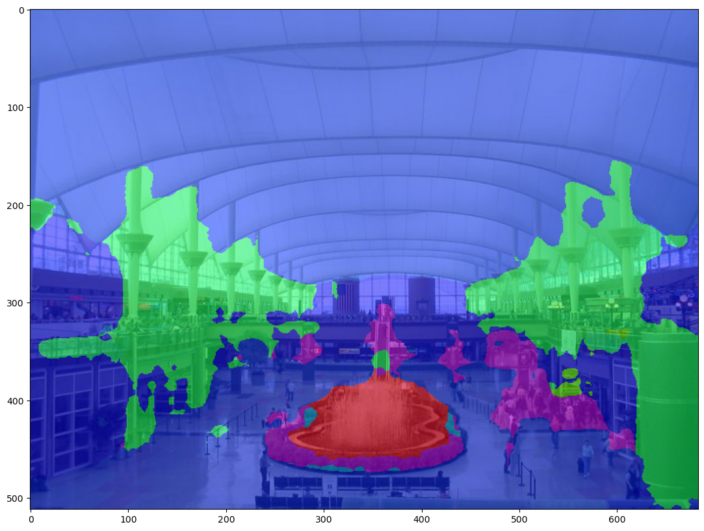
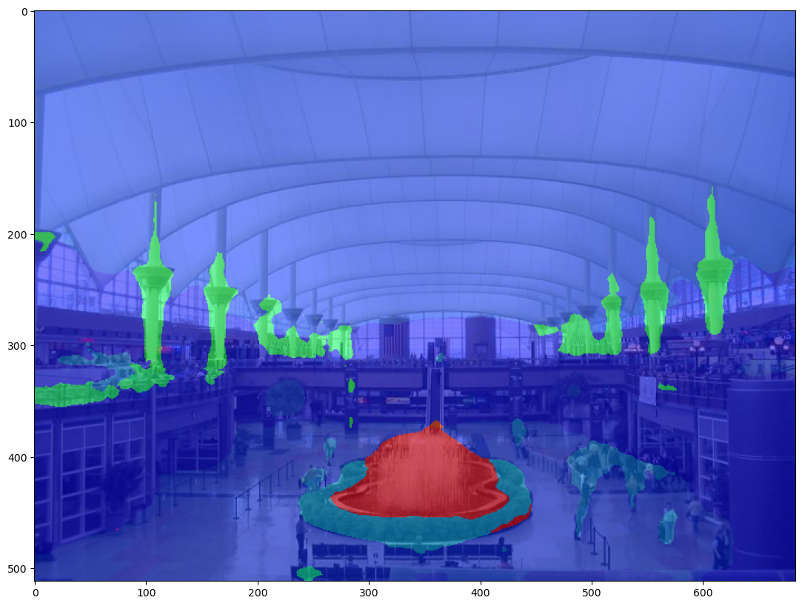
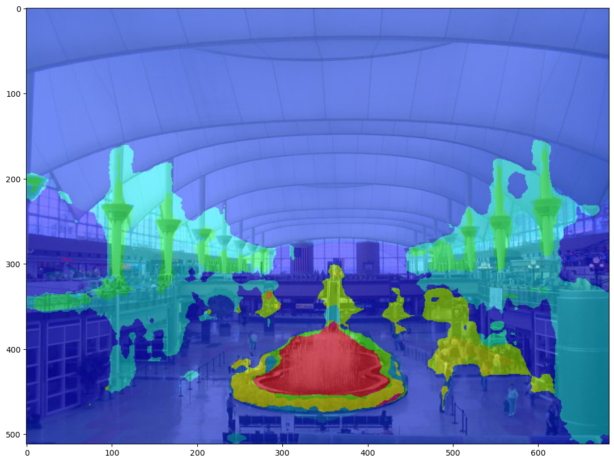

# cs5187-segmentation-mix
Implementation / Code for course project of CS5187.

## Experiments ##

- Counted in mIoU.

|Model|Finetuned SegformerB5|Pretrained BEiT-B|Averaged prediction: Round up|Round down|Nearest integer|Class label: Maximum|Minimum|
|---|---|---|---|---|---|---|---|
|mIoU|**41.01**|3.82|2.09|2.26|2.29|17.16|13.93|
|Mean Accuracy|**54.45**|4.65|7.87|8.38|7.86|37.45|25.59|
|Overall Accuracy|77.73|**83.26**|15.49|16.18|15.99|43.74|50.89|
|Dice|74.73|**79.51**|14.73|15.25|15.10|41.93|48.90|

|Model|Finetuned SegformerB5|Pretrained BEiT-B|Averaged prediction: Round up|
|---|---|---|---|
|Segmentation map||||
